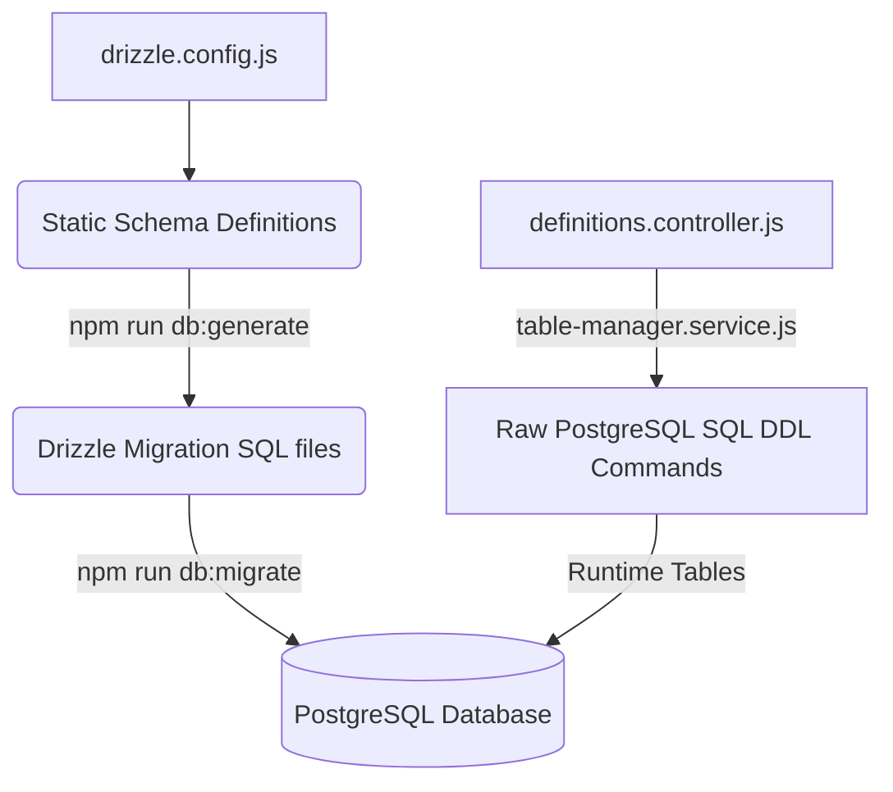
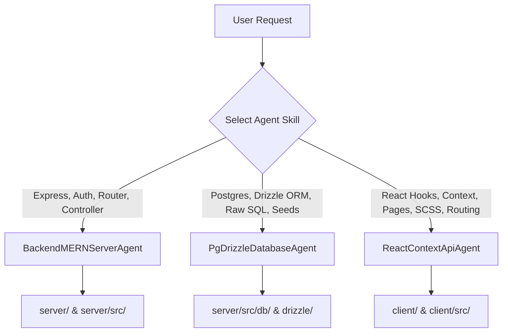

# ERP Starter Kit — Repository & Integration Guide

This document is a comprehensive, zero-ambiguity integration guide for the entire **ERP Starter Kit** repository. It serves as a master blueprint for both software developers and AI coding agents to understand, integrate, run, and extend this codebase.

---

## 1. System Overview & Technology Stack

The ERP Starter Kit is built on a modular, decoupled architecture consisting of a Node.js + Express backend and a Vite + React frontend.

### Tech Stack Blueprint
*   **Frontend**: React (18+), Vite, React Router (v7), Context API for state management, Vanilla SCSS for styling (complying with BEM conventions), and Remix Icons for iconography.
*   **Backend**: Node.js, Express.js (v5), Cookie-Parser, Cors, Morgan, and Express-Validator.
*   **Database & ORM**: PostgreSQL, Drizzle ORM (for static schemas/metadata), Drizzle Kit (migration compiler), and pg (`node-postgres` Pool for dynamic runtime query execution).
*   **Caching & Session Management**: Redis (`ioredis`) for token blacklisting, sliding window rate-limiting, and cache management.
*   **Testing**: Jest and Supertest (configured for ES modules).

---

## 2. Directory Structure & Modular Philosophy

The repository strictly enforces a **self-contained feature-first directory layout**. Every core business module is encapsulated inside a single folder on both the server and client.

### Modular Copy-Paste Philosophy
To copy a feature (e.g., `crud`, `dashboard`, `auth`) to another codebase, you must only:
1. Copy the server folder `server/src/modules/{feature}/` to the target server directory.
2. Copy the client folder `client/src/features/{feature}/` to the target client directory.
3. Glue the module to the central application using **2 lines of server code** and **3 lines of client code**.

### Repository File Mapping
```txt
d:\Code\testing-ai\
├── .ai/                            # Repository Memory Context Directory
├── server/                         # Express Backend Server Root
│   ├── drizzle/                    # Auto-generated Drizzle Kit sql migrations
│   ├── src/
│   │   ├── app.js                  # App startup and route registry
│   │   ├── server.js               # Database connect & listener initialization
│   │   ├── config/                 # Centralized configuration (db, cache, envConfig)
│   │   ├── db/
│   │   │   ├── migrate.js          # Migration runner script
│   │   │   ├── seed.js             # User and database seeder script
│   │   │   ├── schema/             # Static database tables schemas registry
│   │   │   │   ├── schema.js       # Central schema registry file
│   │   │   │   └── users.schema.js # Drizzle schema for users
│   │   │   └── query/              # Database read abstraction queries
│   │   ├── middlewares/            # Application-level middlewares
│   │   ├── modules/                # Self-contained backend feature modules
│   │   │   ├── auth/               # Authentication, Session, and User updates
│   │   │   ├── crud/               # Dynamic CRUD schema and query engine
│   │   │   └── dashboard/          # Config-driven dashboard metadata services
│   │   └── utils/                  # Shared utilities (responses, errors)
│   └── package.json
└── client/                         # Vite + React Frontend Client Root
    ├── src/
    │   ├── main.jsx                # Application React mount file (AuthProvider wrapper)
    │   ├── app/
    │   │   ├── App.jsx             # RouterProvider configuration
    │   │   ├── app.routes.jsx      # Navigation route hierarchy
    │   │   ├── index.scss          # Central Sass file (feature styles registration)
    │   │   └── _variables.scss     # CSS variables, HSL colors, design tokens
    │   ├── features/               # Self-contained frontend features
    │   │   ├── admin/              # User management dashboard (Admin role required)
    │   │   ├── auth/               # Login, Register, Profile, and Protected Routes
    │   │   ├── crud/               # Auto-forms, Auto-tables, CRUD detail lists
    │   │   ├── dashboard/          # Dynamic grid widgets container & renderers
    │   │   └── shared/             # Layout components (Sidebar, Navbar, Contexts)
    └── package.json
```

---

## 3. Environment Variables & Setup Configuration

Verify that your target environment contains the following configuration variables:

### 3.1 Server Environment (`server/.env`)
Create a `.env` file inside the `server/` directory:
```env
SERVER_PORT=3000
SERVER_URL=http://localhost:3000
CLIENT_ORIGINS=http://localhost:5173,http://127.0.0.1:5173

# Database Connection (PostgreSQL)
DATABASE_URL=postgresql://<username>:<password>@<host>:<port>/<dbname>?sslmode=require

# JWT Token Signing Secret
JWT_SECRET=8f5b8a05c6d3eb84920fe8494b29b4e1837a4e69bdecf3a9f02930dbfe49ab3d

# Redis Configuration
REDIS_HOST=localhost
REDIS_PORT=6379
REDIS_PASSWORD=your_redis_password

# External Integrations (Mandatory Validation Constraints)
GOOGLE_CLIENT_ID=mock_google_client_id
GOOGLE_CLIENT_SECRET=mock_google_client_secret
GOOGLE_REFRESH_TOKEN=mock_google_refresh_token
GOOGLE_SENDER_EMAIL=noreply@example.com

MJ_APIKEY_PUBLIC=mock_mailjet_public_key
MJ_APIKEY_PRIVATE=mock_mailjet_private_key
MJ_USER=noreply@example.com

IMAGEKIT_PRIVATE_KEY=mock_imagekit_private_key
```

### 3.2 Client Configuration
Vite uses [runtime.config.js](file:///d:/Code/testing-ai/client/src/app/runtime.config.js) or `.env` files to fetch config values. Ensure backend connection URLs point to Port 3000:
```javascript
window.ENV = {
  API_URL: 'http://localhost:3000/api',
};
```

---

## 4. Database Layer, Migrations, & Seeding Flow

The database layer utilizes a hybrid approach: **static schemas** are managed via Drizzle ORM, and **dynamic database schemas** are run using parameterized raw PostgreSQL commands to allow runtime customizations without application redeployments.



### 4.1 Schema Setup
1. **Static Tables**: Handled via Drizzle schemas (e.g. `users`, `entity_definitions`, `field_definitions`). Registry: [schema.js](file:///d:/Code/testing-ai/server/src/db/schema/schema.js).
2. **Dynamic Tables**: Named as `crud_{entity_slug}` (e.g., `crud_product`, `crud_lead`). They are created, altered, and dropped using the `table-manager.service.js` using strict sanitize checks (regex: `/^[a-zA-Z_][a-zA-Z0-9_]*$/`) to prevent SQL Injection.

### 4.2 Database Execution Commands
Run these commands from the `server/` directory:

*   **Generate Migrations**: Compile schemas from `server/src/db/schema/schema.js` into sql scripts inside `server/drizzle/`:
    ```bash
    npm run db:generate
    ```
*   **Run Migrations**: Apply Drizzle SQL scripts to PostgreSQL:
    ```bash
    npm run db:migrate
    ```
*   **Seed Database**: Populates database with default users (Admin + Users) and initial dynamic CRUD structures (Products + Leads):
    ```bash
    npm run db:seed
    ```

---

## 5. Existing Modules Detail & Integration Specifications

This section outlines the detailed API interfaces, payloads, client hooks, and layout rules for the existing core modules.

---

### Module 5.1: Authentication & Role-Based Access Control (`auth`)

This module manages secure session validation, role gates, user profile management, password updates, and self soft-deletions.

#### A. Session Mechanism
*   **Authorization Cookie**: When a user registers or logs in, the server sets an HTTP-Only, secure (in production), same-site cookie named `token`.
*   **Logout Mechanism**: The token is invalidated on the client by clearing the cookie, and its payload identifier is stored in Redis with a TTL matching the token's remaining time. The `authMiddleware.protect` check verifies the token is not blacklisted before granting route access.

#### B. Backend API Reference (Auth Prefix: `/api/auth`)

##### Register a User
*   **Endpoint**: `POST /api/auth/register`
*   **Headers**: `Content-Type: application/json`
*   **Payload**:
    ```json
    {
      "name": "Jane Doe",
      "email": "jane.doe@example.com",
      "password": "strongpassword123"
    }
    ```
*   **Response (201 Created)**:
    ```json
    {
      "success": true,
      "message": "User registered successfully",
      "data": {
        "user": {
          "id": "59a8b662-4d80-4df0-b672-9a2a9b43aad7",
          "name": "Jane Doe",
          "email": "jane.doe@example.com",
          "role": "USER",
          "isActive": true,
          "emailVerified": false,
          "createdAt": "2026-06-09T20:59:33.140Z",
          "updatedAt": "2026-06-09T20:59:33.140Z"
        }
      }
    }
    ```

##### Login User
*   **Endpoint**: `POST /api/auth/login`
*   **Headers**: `Content-Type: application/json`
*   **Payload**:
    ```json
    {
      "email": "jane.doe@example.com",
      "password": "strongpassword123"
    }
    ```
*   **Response (200 OK)**: (Same structure as Registration success).

##### Get Current User Profile
*   **Endpoint**: `GET /api/auth/me`
*   **Headers**: `Cookie: token=<jwt_token>`
*   **Response (200 OK)**:
    ```json
    {
      "success": true,
      "message": "User retrieved successfully",
      "data": {
        "user": {
          "id": "59a8b662-4d80-4df0-b672-9a2a9b43aad7",
          "name": "Jane Doe",
          "email": "jane.doe@example.com",
          "role": "USER",
          "isActive": true,
          "emailVerified": false,
          "createdAt": "2026-06-09T20:59:33.140Z",
          "updatedAt": "2026-06-09T20:59:33.140Z"
        }
      }
    }
    ```

##### Logout User
*   **Endpoint**: `POST /api/auth/logout`
*   **Headers**: `Cookie: token=<jwt_token>`
*   **Response (200 OK)**:
    ```json
    {
      "success": true,
      "message": "User logged out successfully"
    }
    ```

##### Change Password
*   **Endpoint**: `PATCH /api/auth/change-password`
*   **Headers**: `Content-Type: application/json`, `Cookie: token=<jwt_token>`
*   **Payload**:
    ```json
    {
      "currentPassword": "strongpassword123",
      "newPassword": "newstrongpassword123"
    }
    ```
*   **Response (200 OK)**:
    ```json
    {
      "success": true,
      "message": "Password changed successfully"
    }
    ```

##### Self Soft-Delete Account
*   **Endpoint**: `DELETE /api/auth/account`
*   **Headers**: `Cookie: token=<jwt_token>`
*   **Response (200 OK)**:
    ```json
    {
      "success": true,
      "message": "Account deleted successfully"
    }
    ```

#### C. Client Context State & Routing Protection
*   **AuthContext**: Wraps the application and exports `user`, `isAuthenticated`, `loading`, `actionLoading`, `authError`, `toasts`, `login()`, `register()`, `logout()`, `changePassword()`, and `deleteAccount()`.
*   **ProtectedRoute**: Restricts child components to authenticated sessions. Set `requireAdmin={true}` to lock down components exclusively to users with role `ADMIN`.

---

### Module 5.2: Admin User Portal (`admin`)

Provides user auditing features for supervisors to toggle roles and manage users.

#### A. Backend API Reference (Admin Route Prefix: `/api/auth`)

##### List All Users
*   **Endpoint**: `GET /api/auth/users`
*   **Headers**: `Cookie: token=<admin_jwt_token>`
*   **Query Params**: `includeDeleted=true` (Optional)
*   **Response (200 OK)**:
    ```json
    {
      "success": true,
      "message": "Users retrieved successfully",
      "data": {
        "users": [
          {
            "id": "1d1f43bb-d41c-444c-9bd4-d225a37934c6",
            "name": "Jane Doe",
            "email": "jane.doe@example.com",
            "role": "USER",
            "isActive": true,
            "isDeleted": false,
            "deletedAt": null,
            "emailVerified": false,
            "createdAt": "2026-06-09T20:59:46.497Z",
            "updatedAt": "2026-06-09T20:59:46.497Z"
          }
        ]
      }
    }
    ```

##### Update User Role
*   **Endpoint**: `PATCH /api/auth/users/:id/role`
*   **Headers**: `Content-Type: application/json`, `Cookie: token=<admin_jwt_token>`
*   **Payload**:
    ```json
    {
      "role": "ADMIN"
    }
    ```
*   **Response (200 OK)**: Returns success response containing the updated user.

##### Admin Soft-Delete User
*   **Endpoint**: `DELETE /api/auth/users/:id`
*   **Headers**: `Cookie: token=<admin_jwt_token>`
*   **Response (200 OK)**:
    ```json
    {
      "success": true,
      "message": "User soft-deleted successfully"
    }
    ```

#### B. Client Integration
Import `AdminProvider` from `features/admin/AdminContext.jsx` to manage user administration hooks (`fetchUsers()`, `updateUserRole()`, `deleteUser()`). Mount the panel under route `/admin/users`.

---

### Module 5.3: Dynamic CRUD Engine (`crud`)

Allows runtime declaration of new database entities (e.g. Products, Invoices, Leads) without altering source code.

#### A. Architecture and Custom Schemas
When definitions are registered, metadata details are committed to static tables (`entity_definitions` and `field_definitions`). The system translates metadata inputs and issues a raw PostgreSQL query creating the table:
```sql
CREATE TABLE crud_supplier (
  id UUID PRIMARY KEY DEFAULT gen_random_uuid(),
  company_name TEXT NOT NULL,
  contact_email TEXT NOT NULL,
  discount_terms NUMERIC,
  is_deleted BOOLEAN DEFAULT false,
  deleted_at TIMESTAMP WITH TIME ZONE,
  created_at TIMESTAMP WITH TIME ZONE DEFAULT NOW(),
  updated_at TIMESTAMP WITH TIME ZONE DEFAULT NOW()
);
```

#### B. Backend API Reference (CRUD Prefix: `/api/crud`)

##### Register Dynamic Entity (Admin Access Required)
*   **Endpoint**: `POST /api/crud/definitions`
*   **Headers**: `Content-Type: application/json`, `Cookie: token=<admin_jwt_token>`
*   **Payload**:
    ```json
    {
      "name": "Supplier",
      "slug": "supplier",
      "description": "Procurement suppliers database",
      "fields": [
        { "name": "Company Name", "columnName": "company_name", "fieldType": "text", "required": true },
        { "name": "Contact Email", "columnName": "contact_email", "fieldType": "email", "required": true },
        { "name": "Discount Terms", "columnName": "discount_terms", "fieldType": "number", "required": false }
      ]
    }
    ```
*   **Response (201 Created)**: Returns the metadata mapping block and creates the `crud_supplier` table.

##### Perform CRUD Operations on Dynamic Table (All Users)
Use standard REST paradigms mapping directly to the configured slug:
*   `GET /api/crud/:slug` - Paginated lists query (e.g. `/api/crud/supplier?page=1&limit=10&search=Acme`). Filters out soft-deleted records.
*   `GET /api/crud/:slug/:id` - Fetch details of a single record.
*   `POST /api/crud/:slug` - Create record. Validates columns against registered constraints.
*   `PUT /api/crud/:slug/:id` - Update records.
*   `DELETE /api/crud/:slug/:id` - Performs soft-delete (`is_deleted = true`, `deleted_at = NOW()`).

#### C. Client UI Engine Components
*   **`AutoForm`**: Parses field configurations (types, dropdown items, required flags) and mounts corresponding `DynamicField` items with local validation. Supports standard inputs, textareas, options select, checkboxes, and date-pickers.
*   **`AutoTable`**: Generates layout columns, pagination bars, sorting indicators, search logic, and triggers details modal/edit workflows automatically.
*   **`useCrud`**: A hook that manages client-side requests, filters, list responses, and detail updates.

---

### Module 5.4: Dynamic Dashboard (`dashboard`)

A layout orchestration module fetching configured layout blueprints for different roles and mounting corresponding visual blocks.

#### A. Configuration Blueprint (Server Defaults)
Configurations map roles to widget blocks containing size dimensions (`w` and `h` spans in the 12-column responsive layout grid) and settings endpoints. File location: [dashboards.js](file:///d:/Code/testing-ai/server/src/modules/dashboard/config/dashboards.js).
```javascript
export const dashboardConfigs = {
  ADMIN: [
    { id: 'stat-users', widgetType: 'stats-card', w: 4, h: 1, settings: { title: 'Users count', count: 11, icon: 'ri-user-line' } },
    { id: 'sales-chart', widgetType: 'chart', w: 8, h: 3, settings: { title: 'Sales Performance', type: 'line', labels: ['Jan', 'Feb'], data: [1000, 2000] } }
  ],
  USER: [
    { id: 'stat-products', widgetType: 'stats-card', w: 12, h: 1, settings: { title: 'Product Inventory', endpoint: '/api/crud/product' } }
  ]
};
```

#### B. Widgets Catalog
1.  `stats-card`: KPI card showing static values or endpoints statistics.
2.  `chart`: Performance graphs supporting `line` or `bar` layouts.
3.  `recent-table`: Feeds displaying recently added items for specified slugs.
4.  `quick-actions`: Shortcuts pointing to pages (e.g., `Add Product`).
5.  `ai-prompt`: Prompts bar query mock.
6.  `approval-queue`: Process items needing sign-offs.

#### C. Integration Recipe: Add a New Widget Type
To add a new custom widget type (e.g., `audit-log` widget):

##### Step 1: Create Client Presentation Component
Create the component file in `client/src/features/dashboard/components/widgets/AuditLogWidget.jsx`:
```jsx
import React from 'react';

const AuditLogWidget = ({ config }) => {
  const { title } = config.settings;
  return (
    <div className="dashboard-widget dashboard-widget--audit-log">
      <h4>{title}</h4>
      <p>Audit logger content renders here...</p>
    </div>
  );
};

export default AuditLogWidget;
```

##### Step 2: Register in Client Registry
Open [WidgetRegistry.jsx](file:///d:/Code/testing-ai/client/src/features/dashboard/components/WidgetRegistry.jsx), import the component, and map it to a type identifier string:
```javascript
import AuditLogWidget from './widgets/AuditLogWidget.jsx';

const registry = {
  // Existing mappings...
  'audit-log': AuditLogWidget,
};
```

##### Step 3: Insert into Server configuration Layouts
Open [dashboards.js](file:///d:/Code/testing-ai/server/src/modules/dashboard/config/dashboards.js) and append the widget to the desired role arrays:
```javascript
{
  id: 'activity-audit',
  widgetType: 'audit-log',
  w: 6,
  h: 2,
  settings: { title: 'Security Audit Feed' }
}
```

---

## 6. AI Coding Agent Skill Orchestration & Workflow

This repository includes strict execution guidelines for AI development. Agents must align their actions to their specialized roles:



### 6.1 Agent Skills Reference Matrix

#### `BackendMERNServerAgent`
*   **Focus Scope**: Express endpoints logic, HTTP-Only Cookie configurations, rate limiting, middlewares registration, and security controls.
*   **Directory Boundary**: Limit code changes strictly to `server/` and `server/src/` (excluding database configuration `/db/`).

#### `PgDrizzleDatabaseAgent`
*   **Focus Scope**: Static table declarations, migrations generation and compiling, indices performance, raw parameterized SQL queries optimizations, and data seeds logic.
*   **Directory Boundary**: Limit code changes strictly to `server/src/db/` and `drizzle/`.

#### `ReactContextApiAgent`
*   **Focus Scope**: React views structure, layout templates, Context state management, custom async hooks, Vite proxy connections, page routing, and SCSS modules (Sass stylesheets hierarchy).
*   **Directory Boundary**: Limit code changes strictly to `client/` and `client/src/`.

### 6.2 Repository Memory Protocol (`.ai/` directory)
To optimize LLM context usage, agents do not read the entire chat log history. They consult the persistent markdown context files in `.ai/`:
1.  **`PROJECT_CONTEXT.md`**: Master repository architecture context.
2.  **`CURRENT_SPRINT.md`**: Current development objectives checklist.
3.  **`HANDOFF.md`**: Synchronization notes written by agents when ending tasks (detailing structural edits, routes added, and components exported).
4.  **`API_CONTRACTS.md` / `API_RESPONSE.md`**: REST route inputs, query shapes, and returns format definitions.

**Agent Execution Rules**:
*   Always inspect `.ai/CURRENT_SPRINT.md` and appropriate context files before editing code.
*   When changing route behaviors or adding endpoints, immediately document them in `.ai/API_CONTRACTS.md`.
*   Upon completing a sub-phase, write clear handoff notes in `.ai/HANDOFF.md` for subsequent agent processes.
